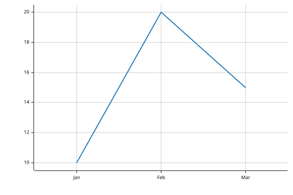
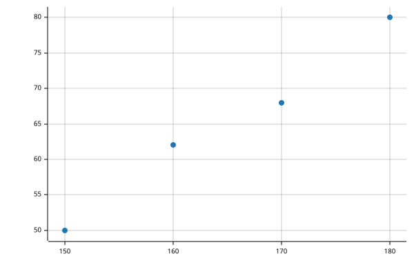
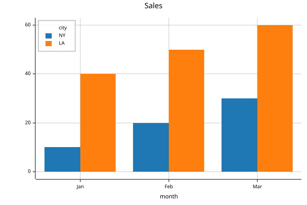
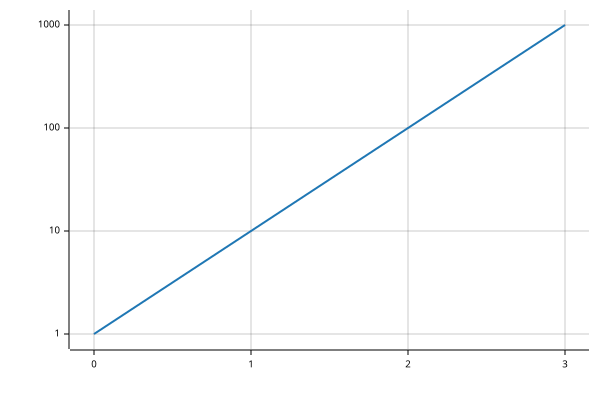
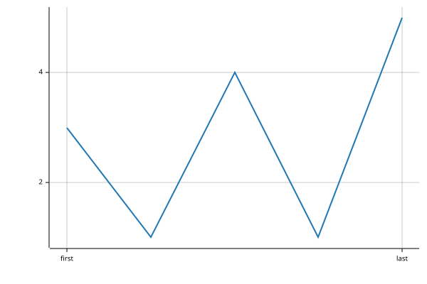
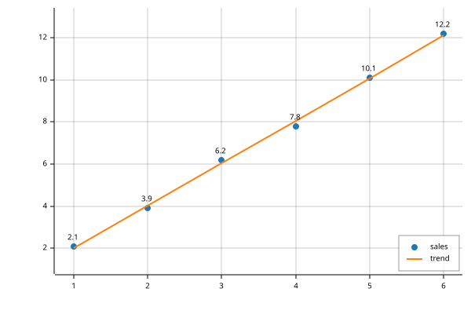
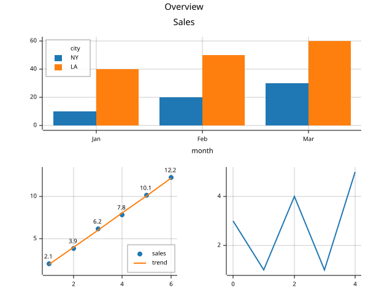
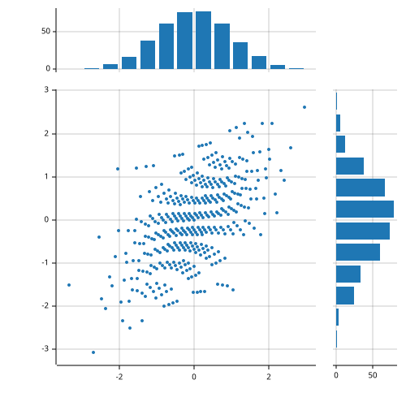

# Plots


<!-- WARNING: THIS FILE WAS AUTOGENERATED! DO NOT EDIT! -->

``` apl
]help •plot
```

`X •plot Y` returns a plot spec: a keyed vector holding the data `Y`,
the settings `X` and a renderer. Notebooks display the spec as an SVG
chart. Plain text on the left is shorthand for `mark`.

The structure of `Y` chooses the series and axes:

- A vector plots its values against `1…n`.
- A keyed vector of numbers uses its keys as x labels.
- A matrix plots one series per row. Row keys name the series. Column
  keys label x.
- A table, a keyed vector of equal-length columns, plots each column as
  a series. A column named `x` supplies the x values.
- A vector or matrix of plots draws a figure.

<table>
<colgroup>
<col style="width: 33%" />
<col style="width: 33%" />
<col style="width: 33%" />
</colgroup>
<thead>
<tr>
<th>Setting</th>
<th>Holds</th>
<th>Default</th>
</tr>
</thead>
<tbody>
<tr>
<td><code>mark</code></td>
<td><code>"line"</code>, <code>"point"</code> or <code>"bar"</code></td>
<td><code>"line"</code></td>
</tr>
<tr>
<td><code>title</code></td>
<td>Chart title</td>
<td>none</td>
</tr>
<tr>
<td><code>width</code>, <code>height</code></td>
<td>Size in pixels</td>
<td><code>600</code>, <code>400</code></td>
</tr>
<tr>
<td><code>x</code>, <code>y</code></td>
<td><code>title</code>, <code>scale</code> (<code>"linear"</code> or
<code>"log"</code>) and <code>ticks</code></td>
<td></td>
</tr>
<tr>
<td><code>legend</code></td>
<td><code>position</code> (<code>"end"</code> or a corner) and
<code>border</code></td>
<td>none</td>
</tr>
<tr>
<td><code>grid</code></td>
<td><code>0</code> hides the grid lines</td>
<td><code>1</code></td>
</tr>
<tr>
<td><code>flip</code></td>
<td><code>1</code> swaps the axes</td>
<td><code>0</code></td>
</tr>
<tr>
<td><code>color</code>, <code>size</code>, <code>labels</code></td>
<td>Styles for every series</td>
<td></td>
</tr>
<tr>
<td><code>series</code></td>
<td>Styles for one series, keyed by its name</td>
<td></td>
</tr>
<tr>
<td><code>widths</code>, <code>heights</code>, <code>share</code></td>
<td>Figure cell sizes and shared axis ranges</td>
<td></td>
</tr>
</tbody>
</table>

`•mime` reports these errors: DOMAIN for unknown settings or values;
LENGTH when series, sizes or labels don’t match the x values; RANK for
data that isn’t a vector, matrix or table.

## Data

A matrix plots one series per row. Its column keys label the x axis.
`"legend":"end"` names each line beside its last point:

``` apl
sales←["city":["NY" "LA"] "month":["Jan" "Feb" "Mar"]]:[10 20 30 ⋄ 40 50 60]
["legend":"end"] •plot sales
```


A keyed vector of numbers uses its keys as x labels:

``` apl
•plot ["Jan":10 "Feb":20 "Mar":15]
```



In a table, a column named `x` supplies the x values. Every other column
is a series:

``` apl
["mark":"point"] •plot ["x":[150 160 170 180] "weight":[50 62 68 80]]
```



## Settings

The result is a plot spec, an ordinary keyed vector. Settings go on the
left, or are assigned later. Assignment through a dot path creates the
settings it needs. A corner position draws a boxed legend, titled by the
row axis name:

``` apl
p←["mark":"bar" "title":"Sales"] •plot sales
p.legend.position←"top-left"
p
```



A `"log"` scale suits values that grow by factors:

``` apl
q←•plot 1 10 100 1000
q.y.scale←"log"
q
```



`ticks` is a number of ticks, a vector of positions, or a keyed vector
from labels to positions:

``` apl
r←•plot 3 1 4 1 5
r.x.ticks←["first":0 "last":4]
r.y.ticks←3
r
```



## Series styles

`mark`, `color`, `size` and `labels` style every series. The same fields
under `series`, keyed by series name, style one series.

- `color` is `"#rrggbb"` or a palette name: `"blue"`, `"orange"`,
  `"green"`, `"red"`, `"purple"`, `"brown"`, `"pink"`, `"gray"`,
  `"olive"` or `"cyan"`. Series take the palette colours in order.
- `size` is the point radius or line width in pixels. For points, one
  number per point sets sizes by value.
- `labels` is `1` to label each point with its value, or one label per
  point. `""` leaves a point unlabelled. Overlapping labels move apart.

Computation stays in APL. Here the trend line is a least-squares fit,
drawn as a second series:

``` apl
x←1 2 3 4 5 6 ⋄ y←2.1 3.9 6.2 7.8 10.1 12.2
m←x*⌝0 1
fitted←["mark":"point"] •plot ["x":x "sales":y "trend":m+.×y⌹m]
fitted.series.trend.mark←"line"
fitted.series.sales.labels←1
fitted.legend.position←"bottom-right"
fitted
```



## Figures

A vector or matrix of plots draws a figure. A vector is one row, and `⍪`
makes a column. A plot repeated in adjacent cells spans them. `widths`
and `heights` give relative cell sizes. `"share":1` gives plots in a
column one x range, and plots in a row one y range:

``` apl
["title":"Overview" "height":500] •plot [p p ⋄ fitted (•plot 3 1 4 1 5)]
```



The figure settings combine into a scatter plot with marginal
histograms. The data comes from a normal distribution’s `quantile` at
evenly spread probabilities. That gives normally distributed values
without randomness:

``` apl
n←•normal 0 1
x←n.quantile 1|0.5+0.618034×⍳400
y←(0.6×x)+0.8×n.quantile 1|0.5+0.754878×⍳400
```

Binning stays in APL. `count` counts the values within 0.25 of each bin
centre. Each histogram is a bar chart of counts. `flip` turns the second
one on its side:

``` apl
centers←¯2.75+0.5×⍳12
count←{+/(⍵≥⍺-0.25)∧⍵<⍺+0.25}
hist←{["x":centers "count":(centers count¨ ⊂⍵)]}
top←["mark":"bar"] •plot hist x
side←["mark":"bar" "flip":1] •plot hist y
```

`widths` and `heights` make the histograms narrow, and `⍬` leaves the
corner empty. `share` lines up each histogram with the scatter plot’s
axis:

``` apl
scatter←["mark":"point" "size":2] •plot ["x":x "y":y]
grid←["widths":[4 1] "heights":[1 4] "share":1 "width":500 "height":500]
grid •plot [top ⍬ ⋄ scatter side]
```


