# Plots


<!-- WARNING: THIS FILE WAS AUTOGENERATED! DO NOT EDIT! -->

``` bpl
]help •plot
```

`X •plot Y` returns a plot spec: a keyed vector holding the data `Y` and
the settings `X`. Its renderer displays the spec as an SVG chart. Plain
text on the left is shorthand for `mark`. [Plots](plot.ipynb) shows each
mark and setting with examples.

The structure of `Y` chooses the series and axes:

- A vector plots its values against `0…n-1`.
- A keyed vector of numbers uses its keys as x labels.
- A matrix plots one series per row. Row keys name the series. Column
  keys label x.
- With the `cell` mark, each row of a matrix is a row of cells, coloured
  by value. Row keys label the rows, and row 0 is at the top.
- A table, a keyed vector of equal-length columns, plots each column as
  a series. A column named `x` supplies the x values.
- A vector or matrix of plots draws a figure.

<table>
<colgroup>
<col style="width: 33%" />
<col style="width: 33%" />
<col style="width: 33%" />
</colgroup>
<thead>
<tr>
<th>Setting</th>
<th>Holds</th>
<th>Default</th>
</tr>
</thead>
<tbody>
<tr>
<td><code>mark</code></td>
<td><code>"line"</code>, <code>"point"</code>, <code>"bar"</code> or
<code>"cell"</code></td>
<td><code>"line"</code></td>
</tr>
<tr>
<td><code>title</code></td>
<td>Chart title</td>
<td>none</td>
</tr>
<tr>
<td><code>width</code>, <code>height</code></td>
<td>Size in pixels</td>
<td><code>600</code>, <code>400</code></td>
</tr>
<tr>
<td><code>x</code>, <code>y</code></td>
<td><code>title</code>, <code>scale</code> (<code>"linear"</code> or
<code>"log"</code>), <code>ticks</code>, and <code>axis</code>
(<code>$f</code> hides that axis)</td>
<td></td>
</tr>
<tr>
<td><code>legend</code></td>
<td><code>position</code> (<code>"end"</code> or a corner) and
<code>border</code></td>
<td>none</td>
</tr>
<tr>
<td><code>grid</code></td>
<td><code>$f</code> hides the grid lines</td>
<td><code>$t</code>, or <code>$f</code> for cells</td>
</tr>
<tr>
<td><code>axes</code></td>
<td><code>$f</code> hides both axes, with their ticks and titles. An
<code>axis</code> setting in <code>x</code> or <code>y</code> overrides
it for that axis</td>
<td><code>$t</code></td>
</tr>
<tr>
<td><code>flip</code></td>
<td><code>$t</code> swaps the axes</td>
<td><code>$f</code></td>
</tr>
<tr>
<td><code>palette</code></td>
<td>Colours for numbers: <code>"viridis"</code>, <code>"gray"</code>, or
a list of colours</td>
<td><code>"viridis"</code></td>
</tr>
<tr>
<td><code>colorbar</code></td>
<td><code>$t</code> shows the colour scale beside the plot</td>
<td><code>$f</code></td>
</tr>
<tr>
<td><code>color</code>, <code>size</code>, <code>labels</code></td>
<td>Styles for every series</td>
<td></td>
</tr>
<tr>
<td><code>series</code></td>
<td>Styles for one series, keyed by its name</td>
<td></td>
</tr>
<tr>
<td><code>widths</code>, <code>heights</code>, <code>share</code></td>
<td>Figure cell sizes and shared axis ranges</td>
<td></td>
</tr>
</tbody>
</table>

`color` also takes one number per point. `palette` turns these numbers
into colours, over the range of every series in the plot. A cell takes
its colour from its own value unless `color` is set.

A direct [`•mime`](#mime) call on a spec reports these errors: `DOMAIN`
for unknown settings or values, and for cells mixed with other marks;
`LENGTH` when series, colours, sizes or labels don’t match the x values;
`RANK` for data that isn’t a vector, matrix or table.

## Data

A matrix plots one series per row. Its column keys label the x axis.
`"legend":"end"` names each line beside its last point:

``` bpl
sales←["city":["NY" "LA"] "month":["Jan" "Feb" "Mar"]]:[10 20 30 ⋄ 40 50 60]
["legend":"end"] •plot sales
```

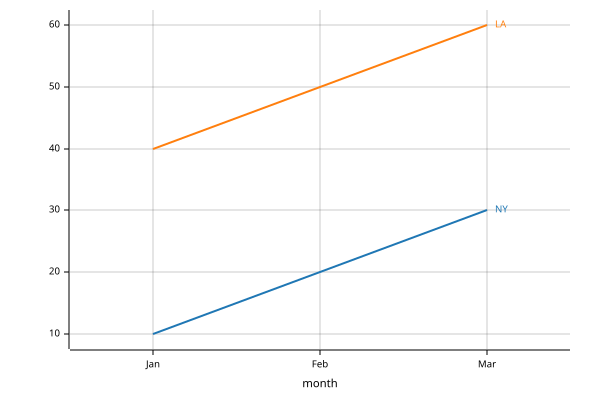

A keyed vector of numbers uses its keys as x labels:

``` bpl
•plot ["Jan":10 "Feb":20 "Mar":15]
```

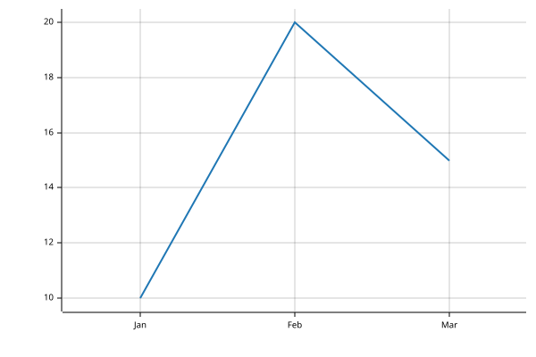

In a table, a column named `x` supplies the x values. Every other column
is a series:

``` bpl
["mark":"point"] •plot ["x":[150 160 170 180] "weight":[50 62 68 80]]
```

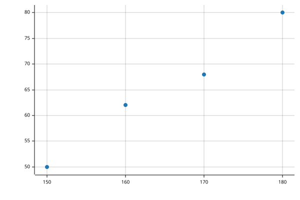

## Settings

`•plot` returns the plot spec, an ordinary keyed vector. Pass settings
as the left argument of `•plot`, or assign them to the spec afterwards.
Assigning through a dot path creates any settings the path needs. A
corner position draws a boxed legend, titled with the name of the row
axis:

``` bpl
p←["mark":"bar" "title":"Sales"] •plot sales
p.legend.position←"top-left"
p
```

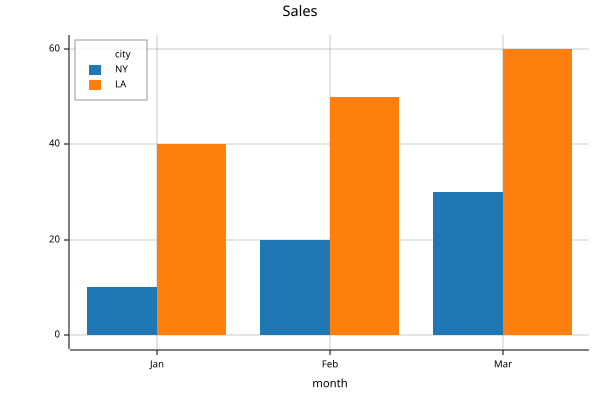

A `"log"` scale suits values that grow by factors:

``` bpl
q←•plot 1 10 100 1000
q.y.scale←"log"
q
```

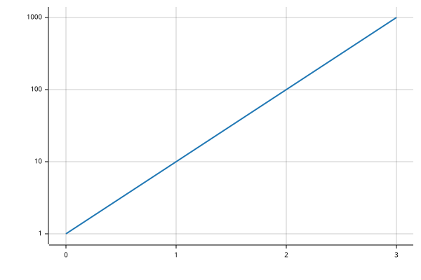

`ticks` is a number of ticks, a vector of positions, or a keyed vector
from labels to positions:

``` bpl
r←•plot 3 1 4 1 5
r.x.ticks←["first":0 "last":4]
r.y.ticks←3
r
```

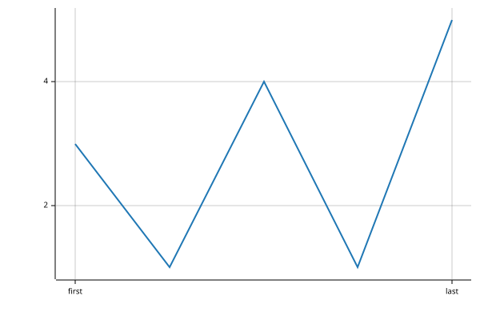

## Series styles

`mark`, `color`, `size` and `labels` style every series. The same fields
under `series`, keyed by series name, style one series.

- `color` is `"#rrggbb"` or a colour name: `"blue"`, `"orange"`,
  `"green"`, `"red"`, `"purple"`, `"brown"`, `"pink"`, `"gray"`,
  `"olive"`, `"cyan"`, `"black"` or `"white"`. Series without a `color`
  take the colours from `"blue"` to `"cyan"` in order. One colour or one
  number per point colours each point separately, as [Colour from
  data](#colour-from-data) describes.
- `size` is the point radius or line width in pixels. For points, one
  number per point sets sizes by value.
- `labels` is `1` to label each point with its value, or one label per
  point. `""` leaves a point unlabelled. Overlapping labels move apart.

Computation stays in BPL. Here the trend line is a least-squares fit,
drawn as a second series:

``` bpl
x←1 2 3 4 5 6 ⋄ y←2.1 3.9 6.2 7.8 10.1 12.2
m←x*⊗0 1
fitted←["mark":"point"] •plot ["x":x "sales":y "trend":m+.×y⌹m]
fitted.series.trend.mark←"line"
fitted.series.sales.labels←1
fitted.legend.position←"bottom-right"
fitted
```

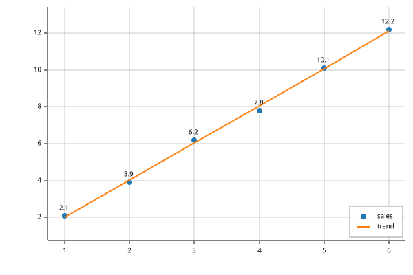

## Colour from data

One number per point in `color` colours each point by value. `palette`
maps the numbers onto colours, from the lowest value in the plot to the
highest. The palette is `"viridis"` (the default), `"gray"`, or a list
of colours spaced evenly along that range. `"colorbar":$t` shows the
scale beside the plot:

``` bpl
["mark":"point" "size":8 "color":[30 25 40 35] "colorbar":$t] •plot ["x":[150 160 170 180] "weight":[50 62 68 80]]
```

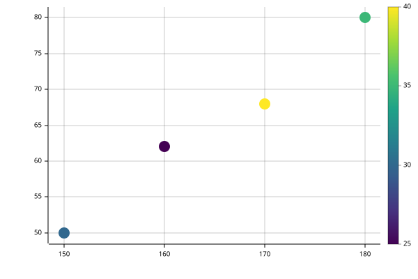

The `cell` mark draws each row of a matrix as a row of cells, coloured
by value. Row 0 is at the top, matching the printed matrix. Row keys
label the rows:

``` bpl
["mark":"cell" "colorbar":$t] •plot sales
```

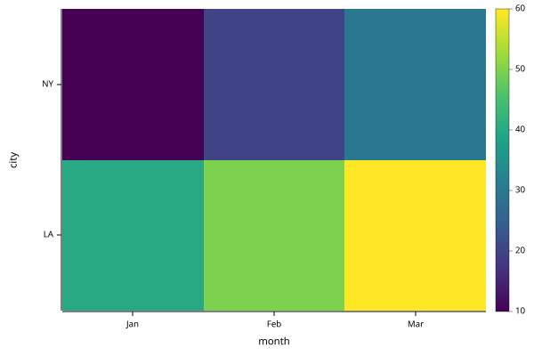

A Sierpinski carpet is a 3×3 block with its centre removed. Each filled
cell holds a smaller copy of the whole carpet. `kron` is the Kronecker
product: each item of `⍺` scales a copy of `⍵`. `block↣kron⍣3 block`
applies it three times, giving an 81×81 carpet. Setting `"axes":$f`
leaves only the cells, without axes or ticks. `p.y.axis←$f` hides only
the y axis. A setting in `x` or `y` takes precedence over `axes`.
`•plot` draws each run of same-coloured cells in a row as one rectangle.
The picture has far fewer SVG elements than cells:

``` bpl
block←[1 1 1
       1 0 1
       1 1 1]
kron←{((⍴⍺)×⍴⍵)⍴0 2 1 3⍉⍺×⊗⍵}
plotopts←["mark":"cell" "palette":["white" "black"] "axes":$f "width":400 "height":400]
plotopts •plot block↣kron⍣3 block
```

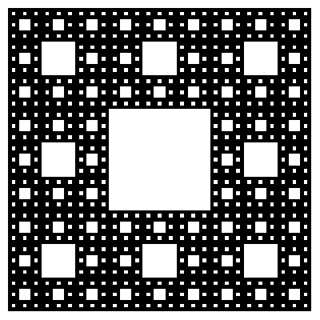

## Figures

A vector or matrix of plots displays as a figure. A vector is one row,
and `⍪` makes a column. A plot repeated in adjacent cells spans them.
`widths` and `heights` give relative cell sizes. With `"share":1`, plots
in the same column share one x range, and plots in the same row share
one y range:

``` bpl
["title":"Overview" "height":500] •plot [p p ⋄ fitted (•plot 3 1 4 1 5)]
```

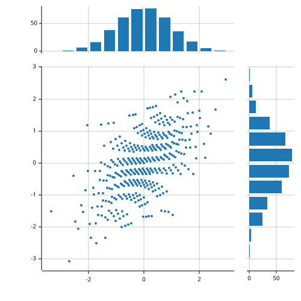

The figure settings combine into a scatter plot with marginal
histograms. The data comes from a normal distribution’s `quantile` at
evenly spread probabilities. That gives normally distributed values
without randomness:

``` bpl
n←•normal 0 1
x←n.quantile 1|0.5+0.618034×⍳400
y←(0.6×x)+0.8×n.quantile 1|0.5+0.754878×⍳400
```

Binning stays in BPL. `count` counts the values within 0.25 of each bin
centre. Each histogram is a bar chart of counts. `flip` turns the second
one on its side:

``` bpl
centers←¯2.75+0.5×⍳12
count←{+/(⍵≥⍺-0.25)∧⍵<⍺+0.25}
hist←{["x":centers "count":(centers count¨ ⊂⍵)]}
top←["mark":"bar"] •plot hist x
side←["mark":"bar" "flip":1] •plot hist y
```

With `heights` of `1 4`, the top histogram is a fifth of the figure’s
height. With `widths` of `4 1`, the side histogram is a fifth of the
figure’s width. The top-right corner is empty because its position holds
`⍬`. `share` lines up each histogram with the scatter plot’s axis:

``` bpl
scatter←["mark":"point" "size":2] •plot ["x":x "y":y]
grid←["widths":[4 1] "heights":[1 4] "share":1 "width":500 "height":500]
grid •plot [top ⍬ ⋄ scatter side]
```


