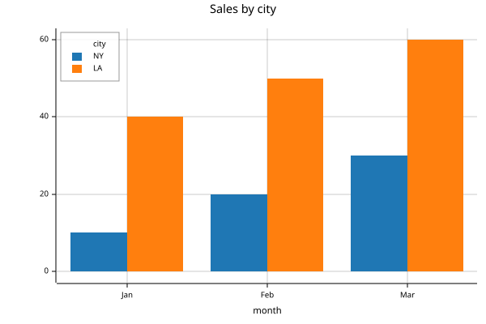
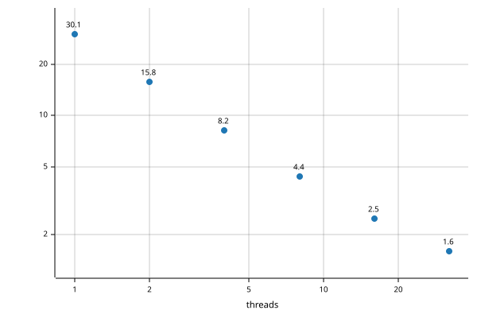

# Python


<!-- WARNING: THIS FILE WAS AUTOGENERATED! DO NOT EDIT! -->

``` python
from basedpl import apl, fn, Array, plus, tally
import numpy as np
```

## Native arrays

`apl` is the APL workspace. It keeps its names for the life of the
Python process. Calling it returns a native `basedpl.Array`. Its
immutable data retains nesting, exact numbers and empty-array
prototypes. Use `.np` or `.py` to convert it.

``` python
v = apl('1 2 4')
v
```

    1 2 4

Python operators use bAsedPL’s array semantics. Python determines
precedence, so this multiplies before adding:

``` python
v * 2 + 1
```

    3 5 9

Indexing counts from 0, as in Python. Negative positions count from the
end. A full `:` selects an axis. Iteration yields rows of a matrix
rather than individual elements:

``` python
a = apl('2 3⍴⍳6')
a.shape, a[0, :], a[:, 1], a[:, -1], list(a)
```

    ((2, 3), [0., 1., 2.], [1., 4.], [2., 5.], [[0., 1., 2.], [3., 4., 5.]])

bAsedPL also exposes functions by their word names. `plus.reduce` is
`+/`; adding `.each` applies it to each nested element:

``` python
nested = apl('[[1 2] [3 4 5]]')
nested
```

    [[1 2] [3 4 5]]

In Python, chain the corresponding word functions:

``` python
plus.reduce.each(nested)
```

    3 12

``` python
f = plus.reduce.each
f(nested)
```

    3 12

Python integers become exact values. Functions compose too:
`plus.reduce / tally` builds the mean function `+/÷≢`. Its result is
still a native array, even when scalar:

``` python
exact = Array([1, 2, 4])
mean_native = plus.reduce / tally
mean_native(exact)
```

    7r3

The native representation uses Python numeric notation: `2` is exact and
`2.` is approximate. `.apl` returns the APL display as a string:

``` python
v.apl, exact.apl
```

    ('1 2 4', '1ₓ 2ₓ 4ₓ')

## The workspace

`apl` is shared by the whole Python process, including the [notebook
magics](notebooks.ipynb). `apl(']clear')` removes every name and
restores the starting display settings.

Calling `apl` returns a native array or function and prints explicit APL
output. It suppresses implicit APL display. Use `.np` or `.py` when you
need a converted result:

``` python
apl('3 3⍴⍳9').np
```

    array([[0., 1., 2.],
           [3., 4., 5.],
           [6., 7., 8.]])

Module and `apl` attributes expose the builtins. Glyph names (`add`,
`dash`, `mul`, `div`) accept either valence; operation names (`plus`,
`subtract`, `times`, `divide`) curry a dyadic call. Thus `add` with one
argument conjugates, while `plus(2)` binds the right argument:

``` python
apl.add(2+3j).py, apl.plus(2)(3).py, apl.times(2)([1, 2, 3]).py
```

    ((2-3j), 5, array([2, 4, 6]))

Keyword arguments bind Python values in the workspace. Square brackets
read an APL expression or assign a value:

``` python
apl(x=np.arange(1, 6))
apl['v'] = [3,1,4,1,5]
apl['{⍵ ⍋⍵}v'].np
```

    array([1, 1, 3, 4, 5])

`fn` makes a composable `Function` from an APL function expression. It
is the same as `apl.fn`. Pass one argument for a monadic call or two for
a dyadic call. Python integers stay exact, so `.py` converts this mean
to a `Fraction` rather than a float:

``` python
apl('mean←{⍝ Mean of a vector\n(+/⍵)÷≢⍵}')
mean = fn('mean')
mean([1,2,4]).py
```

    Fraction(7, 3)

### Names and help

Type `mean?` for its comment help and `mean??` for APL source. The same
information is available programmatically:

``` python
mean.source, apl.names('me')
```

    ('{⍝ Mean of a vector\n(+/⍵)÷≢⍵}', ['mean'])

See [names and help](introspection.ipynb) for source lookup, erasure and
inspection APIs.

`fn` is late-bound: `fn("foo")` follows later redefinitions of `foo`.
Use `apl("foo")` to retain its current function.

Calls print only explicit output (`⎕←` and display commands). A second
argument of `'explicit'` captures it instead, returning a `Result` with
the native `.value` and the captured `.output`:

``` python
r = apl('⎕←x ⋄ x+1x', 'explicit', x=3)
assert r.value.py == 4
assert r.output == ['3ₓ']
```

`'repl'` also captures implicit expression display, as the APL prompt
shows it. The `%%apl` cell magic uses it. In ordinary Python notebooks,
append `;` to suppress display of a call’s return value.

## Labelled arrays

``` python
data = [[10, 20, 30], [40, 50, 60]]
keys = ('NY', 'LA'), ('Jan', 'Feb', 'Mar')
sales = Array(data, axis_keys=keys, axis_names=('city', 'month'))
sales.axis_names, sales.axis_keys
```

    (('city', 'month'), (('NY', 'LA'), ('Jan', 'Feb', 'Mar')))

Arithmetic matches named axes and aligns their keys, rather than relying
on order. This adjustment lists the months backwards but still adds 1 to
January, 2 to February and 3 to March in each city. `.df` copies the
result to pandas, preserving labels; install pandas to use it.

``` python
months = 'Mar', 'Feb', 'Jan'
adjustment = Array([3, 2, 1], axis_keys=(months,), axis_names=('month',))
(sales + adjustment).df
```

<div>
<style scoped>
    .dataframe tbody tr th:only-of-type {
        vertical-align: middle;
    }
&#10;    .dataframe tbody tr th {
        vertical-align: top;
    }
&#10;    .dataframe thead th {
        text-align: right;
    }
</style>

<table class="dataframe" data-quarto-postprocess="true" data-border="1">
<thead>
<tr style="text-align: right;">
<th data-quarto-table-cell-role="th">month</th>
<th data-quarto-table-cell-role="th">Jan</th>
<th data-quarto-table-cell-role="th">Feb</th>
<th data-quarto-table-cell-role="th">Mar</th>
</tr>
<tr>
<th data-quarto-table-cell-role="th">city</th>
<th data-quarto-table-cell-role="th"></th>
<th data-quarto-table-cell-role="th"></th>
<th data-quarto-table-cell-role="th"></th>
</tr>
</thead>
<tbody>
<tr>
<td data-quarto-table-cell-role="th">NY</td>
<td>11</td>
<td>22</td>
<td>33</td>
</tr>
<tr>
<td data-quarto-table-cell-role="th">LA</td>
<td>41</td>
<td>52</td>
<td>63</td>
</tr>
</tbody>
</table>

</div>

## Plots

`plot` draws a chart from an array, and the result displays as that
chart. Keys label the x axis and the legend, and axis names title them.
Keyword arguments give its settings, with dictionaries for nested ones:

``` python
legend = {'position': 'top-left'}
apl.plot(sales, mark='bar', title='Sales by city', legend=legend)
```



A dict of equal-length lists is a table. Its `x` column supplies the x
values, and every other column is a series. [Plots](plot.ipynb) lists
all the settings.

``` python
threads = [1, 2, 4, 8, 16, 32]
seconds = [30.1, 15.8, 8.2, 4.4, 2.5, 1.6]
apl.plot({'x': threads, 'seconds': seconds}, mark='point', labels=1,
         x={'title': 'threads', 'scale': 'log'}, y={'scale': 'log'})
```



## Values and conversion

`Array` retains atoms, shape, nesting, numeric domain and empty
prototypes. `.is_atom` distinguishes an atom from a rank-zero array;
both have `.shape == ()`. `.apl` is APL display. `.py` converts atoms to
Python values and character vectors to strings. Other arrays become
NumPy arrays, including rank-zero arrays. `.np` always returns an
ndarray.

For [axis-keyed arrays](keyed.qmd), `.py` returns a dict at rank 1 and a
pandas DataFrame at higher ranks. `.np` copies the values. Attach labels
with `Array(data, axis_keys=[rows, cols])`; use `None` for an unkeyed
axis. `.axis_keys` returns a tuple of label tuples or `None`.

`axis_names` names dimensions; `axis_keys` names positions within them.
Matching axis names align before positional broadcasting. `.axis_names`
returns one name or `None` per dimension.

``` python
from basedpl import Array, plus
```

``` python
m = Array([[1, 2, 3], [4, 5, 6]], axis_names=('city', 'month'))
v = Array([10, 20, 30], axis_names=('month',))
assert (m + v).np.tolist() == [[11, 22, 33], [14, 25, 36]]
assert plus.reduce['month'](m).np.tolist() == [6, 15]
assert plus.reduce['month'](m).axis_names == ('city',)
```

`.df` converts any array to a DataFrame. The last axis supplies columns;
earlier axes supply rows, using a MultiIndex above rank 2. Unkeyed axes
are labelled from 0. Install pandas for this conversion. Pandas is
imported on demand.

Axis names become pandas index/column names, including MultiIndex level
names.

``` python
from fractions import Fraction
from basedpl import Array
```

``` python
assert Array(2).apl == '2ₓ'
assert Array(2.).apl == '2'
assert Array(Fraction(1, 3)).py == Fraction(1, 3)
```

<table>
<colgroup>
<col style="width: 50%" />
<col style="width: 50%" />
</colgroup>
<thead>
<tr>
<th>Python input</th>
<th>APL value</th>
</tr>
</thead>
<tbody>
<tr>
<td><code>int</code>, <code>bool</code>, NumPy integers</td>
<td>Exact number</td>
</tr>
<tr>
<td><code>float</code></td>
<td>Approximate real</td>
</tr>
<tr>
<td><code>Fraction</code></td>
<td>Exact rational</td>
</tr>
<tr>
<td><code>complex</code></td>
<td>Approximate complex</td>
</tr>
<tr>
<td><code>str</code></td>
<td>Character vector</td>
</tr>
<tr>
<td>Rectangular list/tuple</td>
<td>Ordinary array</td>
</tr>
<tr>
<td>Ragged list/tuple</td>
<td>Nested array</td>
</tr>
<tr>
<td>NumPy ndarray</td>
<td>Array preserving shape and numeric domain</td>
</tr>
<tr>
<td><code>dict</code> with string keys</td>
<td><a href="keyed.qmd">Keyed vector</a>, recursively. <code>.py</code>
returns a <code>dict</code></td>
</tr>
</tbody>
</table>

`.np` or `np.asarray(a)` always produces an ndarray. Simple numeric
arrays use `int64`, `float64` or `complex128`; fractions, large
integers, nesting and mixed exact/approximate values use `object`.
Character arrays use `U1`.

``` python
import numpy as np
```

``` python
a = Array([[1, 2, 3], [4, 5, 6]])
np.testing.assert_array_equal(a.np, [[1, 2, 3], [4, 5, 6]])
```

Python/NumPy conversions copy. Passing an `Array` back to bAsedPL shares
its immutable value. Keep `Array` to preserve empty prototypes and exact
nesting. NumPy is needed only for ndarray conversion.

## Array operations

Arithmetic uses APL agreement, aligning leading axes. Indexing starts at
0, and negative positions count from the end. `:` selects a whole axis.

``` python
np.testing.assert_array_equal(a + [10, 20], [[11, 12, 13], [24, 25, 26]])
np.testing.assert_array_equal(a[1, :], [4, 5, 6])
np.testing.assert_array_equal(a[:, [0, 2]], [[1, 3], [4, 6]])
np.testing.assert_array_equal(a[:, -1], [3, 6])
```

Comparisons return arrays. `%` uses Python’s operand order for residue;
`//` floors division; `@` is matrix product. `&`/`|` give LCM/GCD, hence
AND/OR on Booleans. `len` and iteration use major cells. Use
`member(x, y)` for membership. Bounded slices are not supported.

## Callable functions

`.fn()` creates a callable APL function. One argument supplies `⍵`; two
supply `⍺, ⍵`. Arguments pass directly as values.

``` python
mean = apl.fn('{(+/⍵)÷≢⍵}')
assert mean([1, 2, 4]).py == Fraction(7, 3)
assert mean([1., 2., 4.]).py == 7 / 3

add = apl.fn('+')
np.testing.assert_array_equal(add([1, 2, 3], 10), [11, 12, 13])
```

`.fn('g')` follows later redefinitions of `g`; `apl('g')` retains its
current function.

Module and `apl` attributes select builtin functions by glyph, glyph
name, operation name or alias. Use underscores for hyphenated names and
a trailing underscore for Python keywords. System functions also accept
names without `•`.

``` python
assert apl.multiply(2, 3).py == 6
assert apl.index_of([4, 2, 7], [7, 4]).py.tolist() == [2, 0]
assert getattr(apl, '+')(2, 3).py == 5
assert apl.add(1+2j).py == 1-2j
assert apl.plus(2)(3).py == 5
assert apl.mul(-2).py == -1
assert apl.times(2)(3).py == 6
assert apl.normal([0., 1.])['cdf'](0.).py == 0.5
```

Glyphs and glyph names are ambivalent: one argument supplies `⍵`, two
supply `⍺, ⍵`. Operation names select valence and curry, as imported
word functions do. The glyph names `add`, `dash`, `mul`, `div`
distinguish them from the dyadic operations `plus`, `subtract`, `times`,
`divide`. Operation names win any remaining overlaps.

``` python
import basedpl as b
from basedpl import add, π
```

``` python
assert add(2).py == 2
assert b.divide(2)(3).py == Fraction(3, 2)
assert π(1).py == np.pi
```

Keyword arguments supply `⍺` as a keyed vector, and the positional
arguments form `⍵`. One positional argument supplies `⍵` directly,
several form a vector, and none supplies `⍬`. System functions take
their options on the left, so options become keyword arguments. Element
functions take attributes the same way:

``` python
circle = b.element('circle')
orange = circle(cx=30, cy=50, r=20, fill='orange')
blue = circle(cx=70, cy=50, r=20, fill='steelblue')
pic = b.svg(orange, blue, width=200)
pic
```


The keyword arguments became attributes. System functions read keyword
arguments as options:

``` python
b.xml(circle(r=10)), b.json('{"a": null}', fill=0)
```

    ('<circle r="10"/>', {'a': 0})

CSV options work the same way. `nget` and `nput` read and write files,
as in `b.nput(text, path='copy.csv')`:

``` python
table = b.csv('price,qty\n10.5,2\n20.0,4\n')
text = b.tocsv(table, separator=';').py
b.csv(text, separator=';').py
```

    {'price': array([10.5, 20. ]), 'qty': array([2, 4])}

`r` compiles a regex into keyed functions, which Python indexes by name:

``` python
p = b.r(r'([a-z]+)([0-9]+)')
p['replace']('$2:$1', 'ab12')
```

    12:ab

Legal Python identifiers such as `π` work directly; other glyphs use
`getattr(b, '+')`. Existing Python attributes win; glyph/operation names
precede unbulleted system names. Thus `apl.binomial` is `!`; use
`apl.fn('•binomial')` for the distribution. Lookup uses exact registered
names and aliases; unknown names raise `AttributeError`. `dir()` lists
available builtins. Workspace variables remain accessible through
`apl['name']`.

[Function vectors](glyphs/brackets.qmd), such as `[+ × ÷]`, retain
callable handles. `first` and `pick` return the selected function:

``` python
from basedpl import first, pick
```

``` python
fs = apl('[+ × ÷]')
assert pick(1, fs)(2, 3).py == 6
assert first(fs)(2, 3).py == 5
```

`Array([f, g])` also constructs a function vector; `.py` and
object-dtype `.np` export Python callables.

`f.source` returns APL source; `f.inspect()` returns source and help.
`apl.names(prefix, classes)` lists visible bindings. `apl.inspect(name)`
reads a name or glyph. IPython supports `f?`, `f??` and name completion
in `apl` strings. See [names and help](introspection.ipynb).

## Word functions

Primitives also have Python names. Dyadic names bind the right argument
when called with one argument; `.left(x)` binds the left.

``` python
from basedpl import plus, times, subtract, tally
```

``` python
assert times(2)(3).py == 6
assert subtract(2)(5).py == 3       # 5−2
assert subtract.left(2)(5).py == -3 # 2−5

mean = plus.reduce / tally
assert mean([1, 2, 4]).py == Fraction(7, 3)
```

Names distinguish valences: `sign`/`times`, `shape`/`reshape`,
`iota`/`index_of`, `first`/`take`, `mix`/`pick`. `times(2.)` binds an
approximate number; `times(2)` an exact one. Operators use the
underlying APL function.

`exponential` and `exponent` name the monadic and dyadic forms of `*`.
`power` names the operator `⍣`, exposed as `f.power(n)`. System
functions are available by name on the module or `apl`, such as
`apl.normal`.

`basedpl.symbols` is the shared naming table used by Python functions
and REPL and notebook completion. Each row is
`(glyph, name, monad, dyad, aliases, shortcut)`: the canonical glyph
name, monadic and dyadic function names (empty when absent), and
space-separated extra completion aliases. It includes operators and
syntax glyphs too, with empty function names. Python replaces hyphens
with underscores and appends an underscore to keywords (`not` → `not_`).
`shortcut` is the REPL’s formatted Alt-key suffix, derived from
`keyboard.json`: `" h"` for Alt-h, `" Sa"` for Alt-Shift-a, or `""` when
absent. The table is directly JSON-serializable for JavaScript
consumers.

<table>
<colgroup>
<col style="width: 50%" />
<col style="width: 50%" />
</colgroup>
<thead>
<tr>
<th>Python</th>
<th>APL</th>
</tr>
</thead>
<tbody>
<tr>
<td><code>f.reduce</code>, <code>f.scan</code></td>
<td><code>f/</code>, <code>f\</code></td>
</tr>
<tr>
<td><code>f.each</code>, <code>f.commute</code></td>
<td><code>f¨</code>, <code>f⍨</code></td>
</tr>
<tr>
<td><code>f.outer</code>, <code>f.inner(g)</code></td>
<td><code>f⌝</code>, <code>f.g</code></td>
</tr>
<tr>
<td><code>f.key</code>, <code>f.stencil(s)</code></td>
<td><code>f⌸</code>, <code>f⌺s</code></td>
</tr>
<tr>
<td><code>f.rank(r)</code>, <code>f.atop(g)</code></td>
<td><code>f⍤r</code>, <code>f⍤g</code></td>
</tr>
<tr>
<td><code>f.after(g)</code>, <code>f.over(g)</code>,
<code>f.before(g)</code></td>
<td><code>f⟜g</code>, <code>f⍥g</code>, <code>f⊸g</code></td>
</tr>
<tr>
<td><code>f.power(n)</code>, <code>f.at(i)</code></td>
<td><code>f⍣n</code>, <code>f@i</code>, with <code>n</code> a count, a
list of counts, <code>∞</code> or a predicate</td>
</tr>
<tr>
<td><code>f.history(n)</code></td>
<td><code>f⍣(⍳1+n)</code> for a count, <code>f⍣[g;]</code> for a
predicate</td>
</tr>
<tr>
<td><code>f.with_inverse(g)</code>, <code>f.under(g)</code></td>
<td><code>f⇄g</code>, <code>f⌾g</code></td>
</tr>
<tr>
<td><code>f.derivative</code></td>
<td><code>f∂</code></td>
</tr>
<tr>
<td><code>f[k]</code></td>
<td><code>f⍠k</code>, axes <code>k</code></td>
</tr>
</tbody>
</table>

Operator properties chain in APL order: `subtract.commute.reduce` is
`-⍨/`. Operators needing another operand retain a hole until supplied:

``` python
twice = times(2)
assert twice.power.each(3)([1, 2]).py.tolist() == [8, 16]  # (twice⍣3)¨
```

`f.power.each(n)` constructs `(f⍣n)¨`, just like `f.power(n).each`. For
multiple missing operands, successive calls fill the innermost
construction first: `f.power.each.power(n)(m)` constructs `((f⍣n)¨)⍣m`.
Complete the operands before passing evaluation arguments.

Arithmetic between functions makes forks: `f+g` is `(f+g)`. `f @ g` is
inner product. `f << g` is the Atop `f⍤g`, and `f >> g` is `g⍤f`.
`f ** n` is power. Python’s precedence applies when building these
expressions.

Math families: `prime`/`prime_mode` (`ℙ`), `factors`/`factor_spec`
(`⨸`), `polynomial`/`polyval` (`⊛`). `windows` is dyadic `↕`.

Roots: `sqrt`/`root` (`√`). Complex coordinates: `real_imag` (`∨`),
`polar` (`∧`), `cis` (`○`). `pi_times`/`pi_ratio` (`π`) give π
multiples/fractions. Also `square`, `double`, `decrement`, `increment`,
`classify`, `binary_encode` and `binary_decode`.

``` python
from basedpl import prime, factors, polyval
```

``` python
assert prime(9).py == 29
np.testing.assert_array_equal(factors(700), [2, 2, 5, 5, 7])
p = polyval.left([1, 2, 3])
assert p(2).py == 17
assert p.derivative(2).py == 14
np.testing.assert_array_equal(p.derivative([10, 20], [1, 2]), [80, 280])
np.testing.assert_array_equal(plus.left(1).history(3)(0), [0, 1, 2, 3])
```

## Printing functions

`to_python(f)` shows a function using Python word names and combinators.

``` python
from basedpl import to_python, plus, times, tally
```

``` python
assert to_python(plus.reduce / tally) == 'plus.reduce / tally'
assert to_python(times(2.)) == 'times(2.)'
assert to_python((plus.reduce / tally).each) == '(plus.reduce / tally).each'
```

For an ambivalent function, `dyad=True` selects the dyadic spelling.
Word functions already specify their valence.

``` python
assert to_python(apl('×')) == 'sign'
assert to_python(apl('×'), dyad=True) == 'times'
assert to_python(apl('2-')) == 'subtract.left(2.)'
assert to_python(apl('{⍵×2}¨')) == 'fn("{⍵×2}").each'
```

Dfns and late-bound `.fn(...)` expressions retain their APL source. Use
`apl('+/÷≢')` to evaluate a function expression and print its assembled
structure. Printing itself never executes APL. Approximate `2` prints as
`2.`, exact `2x` as `2`, and fractions as `Fraction(...)`. Complex array
constants retain APL notation inside `apl(...)`.

The output is explanatory Python spelling. Python argument evaluation
order and workspace definitions remain the caller’s responsibility.

## Errors and interruption

`AplError` provides the diagnostic, `kind`, `message`, `source`, byte
`span`, call context and prior `output`. Completed assignments survive
errors. Capturing calls retain output on the exception; ordinary calls
print it before raising.

Ctrl-C interrupts evaluation. From another thread, call
`apl.interrupt()`. `apl.timeout = 2` gives each evaluation a two-second
deadline. `None`, the default, removes it.

Evaluation runs on the calling thread with the GIL released, so other
Python threads keep running. The workspace remains usable after
interruption. Native-library calls can delay cancellation. For a
hard-kill fallback, use a [process
worker](processes.qmd#interruptible-worker).
