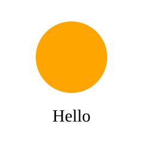
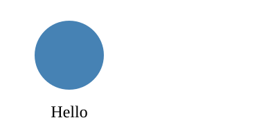
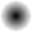
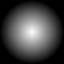
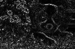

# XML, SVG and images


<!-- WARNING: THIS FILE WAS AUTOGENERATED! DO NOT EDIT! -->

## Elements

``` bpl
]help •element
```

# `•element` — XML elements

`•element tag` returns an element function for the XML tag `tag`. Call
it with attributes on the left and children on the right, as in
`["r":10] circle ""`. An empty right argument, `""` or `⍬`, gives no
children. The result is a keyed vector with `tag`, `attrs` and
`children` entries. Notebooks display it as HTML. In that HTML, the text
of a `script` or `style` element isn’t escaped, as browsers require. A
`script` element can hold JavaScript for the page. [XML and
SVG](xml.ipynb) covers element trees.

Errors: `DOMAIN` for invalid tag or attribute names.

Here `span` makes HTML `span` elements. The result is an ordinary keyed
vector. A notebook displays it as HTML, with its `style` attribute
applied:

``` bpl
span←•element "span"
label←["style":"color:steelblue;font-size:1.5em"] span "a < b"
label
```

<span style="color:steelblue;font-size:1.5em">a &lt; b</span>

Given a list of names, `•element` makes one function for each.
`[ul li]←` names both. Children can be a vector of elements:

``` bpl
[ul li]←•element "ul" "li"
ul li¨ "ab" "cd"
```

<ul><li>ab</li><li>cd</li></ul>

## XML

``` bpl
]help •xml
```

# `•xml` — XML text

`•xml text` reads XML into an element tree with the same meaning.
Attribute values become text. Names keep their prefixes, and namespace
declarations become `xmlns` attributes. Comments, processing
instructions and text that is only whitespace are dropped. [XML and
SVG](xml.ipynb) covers element trees.

`•xml⁻¹ tree` writes the XML text of an element tree. It escapes `&`,
`<`, `>` and `"` in text and attribute values. A numeric vector
attribute becomes space-separated numbers. Children are text, elements
or vectors of children. An element with no children closes itself.

Errors: `DOMAIN` for malformed XML, and for invalid names or attribute
values given to `•xml⁻¹`.

`•xml⁻¹` writes the XML text of an element tree. It escapes text:

``` bpl
•xml⁻¹ label
```

    <span style="color:steelblue;font-size:1.5em">a &lt; b</span>

A numeric vector attribute becomes space-separated numbers. An element
with no children closes itself. `""` and `⍬` both mean no children:

``` bpl
polygon←•element "polygon"
•xml⁻¹ ["fill":"red";"points":0 0 10 0 5 8] polygon ⍬
```

    <polygon fill="red" points="0 0 10 0 5 8"/>

Attribute names keep their case. Prefixed names such as `xlink:href`
pass through unchanged.

## SVG

``` bpl
]help •svg
```

# `•svg` — SVG pictures

`X •svg children` returns an `svg` element with attributes `X`. It adds
`xmlns` for the SVG namespace and `viewBox="0 0 100 100"`. Attributes in
`X` replace these. Notebooks display it as a picture. [XML and
SVG](xml.ipynb) covers element trees.

`width` and `height` set the picture’s displayed size:

``` bpl
[text circle]←•element "text" "circle"
c←["cx":50 "cy":40 "r":25 "fill":"orange"] circle ""
t←["x":50 "y":85 "text-anchor":"middle"] text "Hello"
pic←["width":240 "height":240] •svg c t
pic
```



Elements are keyed arrays with `tag`, `attrs` and `children` entries.
Edit them using ordinary assignment. Display serializes the current
tree.

``` bpl
pic.children₀.attrs.fill←"steelblue"
pic
```


Override `viewBox` with four numbers to choose the drawing coordinates.

``` bpl
["viewBox":0 0 200 100;"width":400;"height":200] •svg pic.children
```



## Rich display

``` bpl
]help •mime
```

# `•mime` — Rich display

`•mime Y` returns the MIME bundle that display uses for `Y`. The bundle
is a keyed vector from MIME types to text, or to bytes for a binary type
such as `image/png`. It always has `text/plain`. If `Y` has a renderer,
`•mime` calls it with `Y` as `⍵` and adds its entries.

The built-in renderers add these types:

- `text/html`: element functions. Natively, a
  [`•canvas`](system/canvas.qmd) drawing too, as HTML that holds its
  data and the script that draws it.
- `image/svg+xml`: [`•svg`](system/svg.qmd) and
  [`•plot`](system/plot.qmd).
- `image/png`: [`•image`](system/image.qmd). An animation is an animated
  PNG in both builds.
- `image/x-rgba;width=N`: a still `•image` picture in the browser build,
  as RGBA pixels, `N` pixels wide. In JavaScript,
  `new ImageData(new Uint8ClampedArray(bytes.buffer), N)` makes a canvas
  image from the bytes.
- `application/x-bpl-canvas+json` and `application/x-bpl-canvas-data`: a
  `•canvas` drawing in the browser build. The npm package’s `canvas.js`
  is a script whose value is a function that draws it:
  `(0, eval)(script)(canvas, json, bytes)`, where `canvas` is a
  `<canvas>` element and `json` and `bytes` are the two entries.

`F •mime Y` returns `Y` with the renderer that `F` holds, as in
`{["text/html":"</b>",⍨"<b>",⍕⍵]}ᵘ •mime Y`. A MIME type on the left
displays `Y` itself as that type, as in `"text/markdown" •mime "*hi*"`.
An atom becomes a scalar, because only an array can hold a renderer.

A result keeps a renderer when it has an item for each item of its
argument, as pervasive functions, Each and scans do. Rearranging or
selecting from an array without removing an axis also keeps it, as
reversal, transpose, take, replicate and catenation do. Changes in place
keep it. Other functions drop it, as reductions and `⍴` do. When two
arguments have different renderers, the result has none. Match ignores
renderers.

Display shows the text form when a renderer fails. Only a direct `•mime`
call reports the error. [Rich display](xml.ipynb#rich-display) covers
renderers.

Errors: `DOMAIN` for a left argument that holds neither a function nor
text.

`F •mime Y` displays `Y` through the renderer that `F` holds. Display
calls the renderer with `Y` as `⍵`. The renderer returns a keyed vector
from MIME types to text, or to bytes for a binary type such as
`image/png`. `F` holds the function in an array, written here with `ᵘ`,
because a function to the left of `•mime` would form a train. This
renderer shows the sum of `items`:

``` bpl
total←{["text/plain":⍕+/⍵.items]}ᵘ •mime ["items":[1 2 3]]
total
```

    6

The renderer isn’t one of `total`’s keys. Changes in place keep the
renderer. It always shows the current values:

``` bpl
total.items+←10
total
```

    36

`•mime` shows the bundle that display uses:

``` bpl
•mime total
```

    ["text/plain":"36"]

A MIME type on the left displays text as that type:

``` bpl
"text/markdown" •mime "**Bold** and *italic*"
```

**Bold** and *italic*

Python arrays implement `_repr_mimebundle_()`. `bpl(code, 'repl')`
captures ordered events in `Result.events`. `Result.output` extracts
their text. `⎕←` produces explicit text output. The native kernel,
notebook magics and `bpl-nb --save` use the rich bundles.

## Images

``` bpl
]help •image
```

# `•image` — Images

`•image Y` returns a picture: numbers from 0 to 1, with axes for rows,
columns and up to four channels, that notebooks display as an image. One
channel is grey, and three are red, green and blue. A second or fourth
channel is alpha. `Y` is the path of a PNG or JPEG file, the bytes of
one, or the numbers themselves. Values outside 0 to 1 are clipped when
the picture is displayed or encoded.

`•image⁻¹ Y` encodes the picture `Y` as PNG bytes. Its left argument
takes the options `format`, which is `"png"` or `"jpeg"`, `fps` and
`delay`. Text alone gives the format, as in `"jpeg" •image⁻¹ Y`. JPEG
drops alpha. [`•nput`](system/nput.qmd) writes the bytes to a file, as
in `"out.png" •nput •image⁻¹ Y`.

An animation has frames along its first axis. A rank-4 array, frames by
rows by columns by channels, is an animation. `["fps":12] •image Y` or
`["delay":0.1] •image Y` makes the first axis of `Y` frames whatever its
rank. A grey animation then needs no channel axis. `fps` sets the frame
rate, 24 frames a second by default. `delay` sets the seconds each frame
stays on screen: one number for every frame, or one per frame. It takes
precedence over `fps`. `["delay":(9⍴0.1),2] •image Y` holds the last of
10 frames for 2 seconds. Notebooks and the [playground](playground.qmd)
play an animation as an animated PNG. `•image⁻¹` encodes an animation as
one, and takes the same options. `•image` reads an animated PNG back as
a rank-4 array, with a channel axis even for grey frames.

Errors: `DOMAIN` for an unknown `format`, invalid image bytes, values
that aren’t real numbers, an `fps` or `delay` that isn’t positive, or an
animation encoded as JPEG; `LENGTH` for a `delay` whose length is
neither 1 nor the number of frames; `RANK` for a shape that isn’t a
picture or an animation; `IO` for file errors.

`•image` displays a matrix of numbers from 0 to 1 as a greyscale
picture. Here each pixel gets brighter with its distance from the
centre:

``` bpl
r←31.5-⍨⍳64
pic←•image 1⌊32÷⍨√r²+⊗r²
pic
```



Pervasive functions keep the picture’s renderer. `1-pic` is the
picture’s negative:

``` bpl
1-pic
```



`•image⁻¹ pic` encodes the picture as PNG bytes. `"out.png" •nput png`
would write them to a file:

``` bpl
png←•image⁻¹ pic
8↑png
```

    [137 80 78 71 13 10 26 10]ₓ

`•image` also reads PNG and JPEG files. A colour picture has a third
axis, holding each pixel’s red, green and blue:

``` bpl
puppy←•image "puppy.jpg"
⍴puppy
```

    [200 300 3]ₓ

Windows, `↕`, can shrink it. With a second row of movements,
`[2 2⋄2 2]↕puppy` cuts the photo into separate 2×2 blocks of pixels.
Averaging each block halves both sides, to 150 pixels wide:

``` bpl
small←•image 0.25×+/⍠[2 3] [2 2⋄2 2]↕puppy
small
```


Edge detection works on one brightness per pixel. An inner product with
the standard luminance weights combines the three colours:

``` bpl
grey←small+.×[0.299 0.587 0.114]
•image grey
```


A Laplacian kernel responds where brightness changes sharply. `3 3↕grey`
gives the 3×3 neighbourhood of every pixel that has one:

``` bpl
k←[0  1 0
   1 ¯4 1
   0  1 0]
win←3 3↕grey
⍴win
```

    [98 148 3 3]ₓ

Multiplying each neighbourhood by the kernel and summing over the last
two axes gives an edge strength for each pixel. Its absolute value shows
the edges as bright lines:

``` bpl
edges←+/+/k×⍤2win
•image |edges
```


